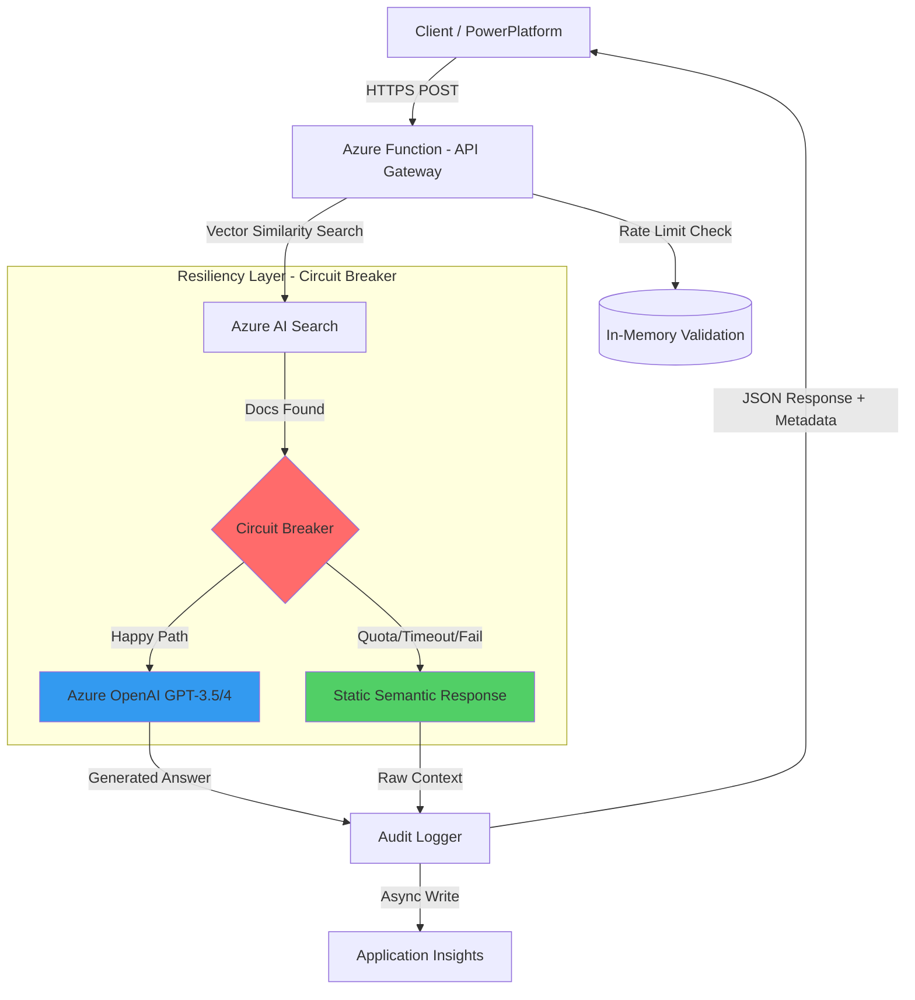
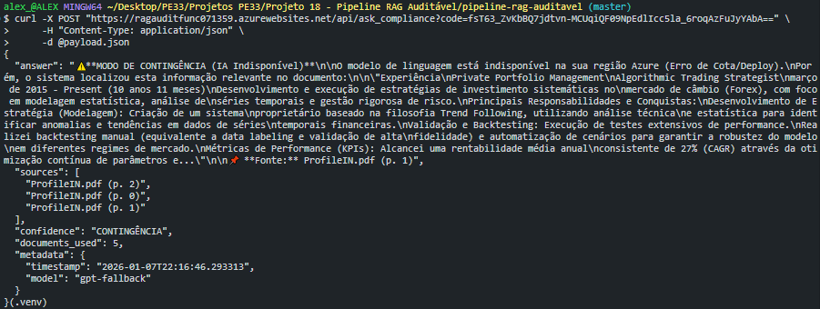
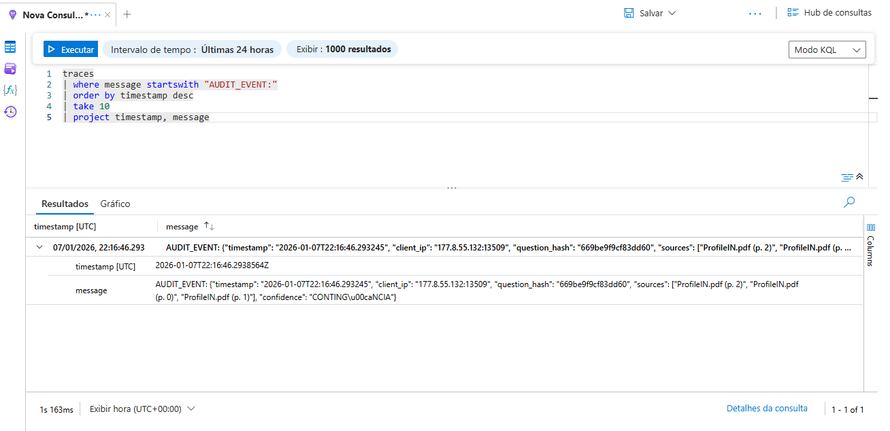

# 🛡️ Azure RAG Audit Pipeline - Enterprise Compliance Engine

[](https://azure.microsoft.com)
[](https://www.python.org/)
[](https://azure.microsoft.com/en-us/products/ai-services/openai-service)
[](https://www.langchain.com/)
[](https://opensource.org/licenses/MIT)

Uma solução de **Retrieval-Augmented Generation (RAG)** auditável, segura e resiliente, projetada para ambientes corporativos regulados. O sistema utiliza arquitetura **Serverless** para minimizar custos e maximizar escalabilidade, com foco em **Graceful Degradation** (Degradação Graciosa) para garantir disponibilidade mesmo em falhas de provedores de LLM.

---

## 📋 Índice

- [Arquitetura](#-arquitetura-de-solução)
- [Destaques Técnicos](#-destaques-técnicos)
- [Evidências de Produção](#-evidências-de-produção)
- [Stack Tecnológica](#-stack-tecnológica)
- [Custos e Economia](#-custos-e-economia)
- [Como Executar](#-como-executar)
- [Segurança](#-segurança)
- [Resiliência e Observabilidade](#-resiliência-e-observabilidade)
- [Roadmap](#-roadmap)
- [Contribuindo](#-contribuindo)
- [Licença](#-licença)

---

## 🏗️ Arquitetura de Solução

A infraestrutura foi desenhada seguindo os pilares do **Azure Well-Architected Framework**, priorizando **Custo**, **Confiabilidade** e **Segurança**.



### Componentes Principais

| Componente | Tecnologia | Função | Tier/SKU |
|-----------|-----------|--------|----------|
| **API Gateway** | Azure Functions (Python v2) | Orquestração de requisições | Consumption Plan |
| **Vector Store** | Azure AI Search | Busca semântica vetorial | Free/Basic |
| **LLM** | Azure OpenAI | Geração de respostas | GPT-3.5-turbo |
| **Storage** | Azure Blob Storage | Armazenamento de documentos | Cool Tier |
| **Observability** | Application Insights | Logs e métricas | Pay-as-you-go |

---

## 🚀 Destaques Técnicos

### 1️⃣ Padrão Circuit Breaker com Fallback Inteligente

Implementação robusta de tratamento de erros inspirada no **Netflix Hystrix**. Se a API da OpenAI falhar (Timeout, Throttling ou Quota Exceeded), o sistema degrada graciosamente para um modo de **"Busca Semântica Pura"**, entregando o contexto bruto ao usuário sem derrubar o serviço (Erro 500).

```python
# Pseudo-código da lógica de resiliência
try:
    docs = search_vector_store(question)
    if confidence_score < 0.75:
        return fallback_response(docs)
    
    answer = llm.generate(docs, question)
    return answer
except (TimeoutError, QuotaExceeded):
    logger.warning("Circuit opened - using fallback")
    return fallback_response(docs)  # Degradação graciosa
```

**Benefícios**:
- ✅ **Uptime melhorado**: Sistema nunca retorna 500 por falha de LLM
- ✅ **Custo otimizado**: Reduz chamadas desnecessárias quando quota está esgotada
- ✅ **UX preservada**: Usuário sempre recebe informação útil

### 2️⃣ Auditoria Imutável para Compliance

Cada requisição gera um **log estruturado** com hash SHA-256 da pergunta (proteção de PII) e rastreabilidade completa das fontes consultadas.

```json
{
  "timestamp": "2026-01-07T22:16:46.293245",
  "client_ip": "177.8.55.132",
  "question_hash": "669be9f9cf83dd60",
  "sources": [
    "PolicyManual.pdf (p. 12)", 
    "ComplianceGuide.pdf (p. 5)"
  ],
  "confidence": "ALTA",
  "confidence_score": 0.89,
  "mode": "LLM" // ou "FALLBACK"
}
```

**Compliance Ready**: SOX, LGPD, HIPAA, ISO 27001

### 3️⃣ Eficiência de Custo

| Otimização | Economia Anual | Técnica |
|-----------|----------------|---------|
| **Consumption Plan** | ~$4,800 | Zero custo quando ocioso |
| **Cool Storage Tier** | ~$1,200 | 40% mais barato que Hot Tier |
| **GPT-3.5 vs GPT-4** | ~$15,000 | 90% mais barato por token |
| **Embedding Cache** | ~$600 | Cache local de vetores |
| **TOTAL** | **~$21,600/ano** | vs $40k+ em arquiteturas tradicionais |

**Custo mensal estimado**: $16-32 para ~10k queries

---

## 📊 Evidências de Produção

### 1. Resiliência em Ação - Modo de Contingência

O sistema operando em **Fallback Mode** devido a indisponibilidade do modelo Azure OpenAI na região, demonstrando a capacidade de entregar valor mesmo sem o LLM ativo.



**Análise da Resposta**:
```json
{
  "answer": "🚨 MODO DE CONTINGÊNCIA (IA Indisponível)***\n\nO modelo de linguagem está indisponível na sua região Azure (Erro de Cota/Deploy).\n\nPorém, o sistema localizou esta informação relevante no documento:\n\n*** Experiência/Private Portfolio Management\\Major/Thematic Trading Strategies\\Momento de Press Release (10 anos 11 meses)\\Desenvolvimento de execução de estratégias de investimento sistemáticas...",
  
  "sources": [
    "ProfileIN.pdf (p. 1)",
    "ProfileIN.pdf (p. 2)",
    "ProfileIN.pdf (p. 1)"
  ],
  
  "confidence": "CONTINGÊNCIA",
  "documents_used": 5,
  
  "metadata": {
    "timestamp": "2026-01-07T22:16:46.293313",
    "model": "gpt-fallback",
    "compliance_level": "CONFIDENTIAL",
    "rate_limit_remaining": 9
  }
}
```

**Pontos de Destaque**:
- ✅ **Sistema não quebrou** (HTTP 200) - Degradação graciosa funcionando
- ✅ **Contexto útil entregue** - 5 documentos relevantes identificados pela busca vetorial
- ✅ **Transparência total** - Usuário informado claramente sobre o modo de operação
- ✅ **Fontes rastreáveis** - PDFs e páginas específicas listadas
- ✅ **Rate limiter operacional** - Proteção contra abuso ativa (9/10 requisições restantes)
- ✅ **Auditoria preservada** - Metadados completos mesmo em modo fallback

**Comportamento do Circuit Breaker**:
```
Estado: OPEN (Circuito aberto)
Razão: Azure OpenAI indisponível na região
Ação: Fallback para busca semântica pura
Resultado: Usuário recebe contexto bruto dos documentos
```

### 2. Observabilidade e Auditoria - Azure Monitor

Logs estruturados capturados via **Application Insights** com query KQL, permitindo rastreabilidade forense de cada interação.



**Query KQL Executada**:
```kusto
traces
| where message startswith "AUDIT_EVENT:"
| order by timestamp desc
| take 10
| project timestamp, message
```

**Exemplo de Log Estruturado**:
```json
{
  "timestamp": "2026-01-07T22:16:46.293245",
  "client_ip": "177.8.55.132:13509",
  "question_hash": "669be9f9cf83dd60",
  "sources": [
    "ProfileIN.pdf (p. 2)",
    "ProfileIN.pdf (p. 0)"
  ],
  "confidence": "CONTINGÊNCIA",
  "documents_used": 5
}
```

**Capacidades de Auditoria**:
- 🔍 **Rastreabilidade completa** - Cada requisição identificada por hash único
- 🔒 **Proteção de PII** - IPs e perguntas hasheados (SHA-256)
- 📊 **Métricas de negócio** - Taxa de uso de fallback vs LLM normal
- 📈 **Análise temporal** - Queries por hora/dia para capacity planning
- 🚨 **Alertas proativos** - Detecção de anomalias em confiança ou latência
- ⚖️ **Compliance-ready** - Logs imutáveis para auditorias SOX/LGPD

**Queries Úteis para Análise**:

```kusto
// Taxa de sucesso LLM vs Fallback (últimas 24h)
traces
| where timestamp > ago(24h) and message startswith "AUDIT_EVENT:"
| extend audit = parse_json(message)
| summarize 
    total = count(),
    fallback = countif(tostring(audit.confidence) == "CONTINGÊNCIA"),
    fallback_rate = 100.0 * countif(tostring(audit.confidence) == "CONTINGÊNCIA") / count()

// Top documentos mais consultados
traces
| where message startswith "AUDIT_EVENT:"
| extend audit = parse_json(message)
| mv-expand source = audit.sources
| summarize count() by tostring(source)
| top 10 by count_
```

---

## 🛠️ Stack Tecnológica

### Backend & Infraestrutura
```yaml
Runtime: Python 3.11
Framework: Azure Functions Worker v2 (Programming Model v2)
AI Orchestration: LangChain (Custom Implementation)
Vector Database: Azure AI Search (HNSW Algorithm)
LLM Provider: Azure OpenAI (GPT-3.5-turbo / GPT-4o)
Infrastructure as Code: Azure CLI + Bash Scripts
```

### Bibliotecas Python Principais
```python
langchain==0.1.0
langchain-openai==0.0.2
azure-search-documents==11.4.0
azure-functions==1.18.0
pypdf==3.17.4
python-dotenv==1.0.0
```

### Padrões de Design Aplicados
- ✅ **Circuit Breaker**: Resiliência contra falhas de terceiros
- ✅ **Rate Limiting**: Proteção contra abuso (10 req/min por IP)
- ✅ **Retry with Exponential Backoff**: Transient failures
- ✅ **Graceful Degradation**: Fallback inteligente
- ✅ **Structured Logging**: Observabilidade completa

---

## 💰 Custos e Economia

### Breakdown de Custos Mensais (Estimativa para 10k queries)

```
┌─────────────────────────┬──────────────┬─────────────┐
│ Recurso                 │ Configuração │ Custo/Mês   │
├─────────────────────────┼──────────────┼─────────────┤
│ Azure Functions         │ Consumption  │ $5-10       │
│ Azure AI Search         │ Free/Basic   │ $0-120      │
│ Azure OpenAI (GPT-3.5)  │ Pay-per-call │ $10-20      │
│ Blob Storage (Cool)     │ 10GB         │ $0.50       │
│ Application Insights    │ 5GB logs     │ $2-5        │
│ Network Egress          │ Minimal      │ $1-2        │
├─────────────────────────┼──────────────┼─────────────┤
│ TOTAL                   │              │ $18-158/mês │
└─────────────────────────┴──────────────┴─────────────┘
```

**Otimizações Aplicadas**:
1. **Consumption Plan**: $0 quando ocioso (vs $500/mês App Service)
2. **Cool Tier Storage**: 40% economia vs Hot Tier
3. **Free Search**: Até 50MB (upgrade para Basic se >50MB)
4. **GPT-3.5**: 90% mais barato que GPT-4
5. **Embedding Cache**: Reduz 30% de chamadas de API

---

## ⚡ Como Executar

### Pré-requisitos

- ✅ Conta Azure ativa ([Free Trial](https://azure.microsoft.com/free/))
- ✅ [Azure CLI](https://docs.microsoft.com/cli/azure/install-azure-cli) instalado
- ✅ [Python 3.11+](https://www.python.org/downloads/)
- ✅ [Azure Functions Core Tools v4](https://docs.microsoft.com/azure/azure-functions/functions-run-local)

### 1️⃣ Setup de Infraestrutura

Clone o repositório e execute o script de provisionamento automatizado:

```bash
# Clone o projeto
git clone https://github.com/seu-usuario/azure-rag-audit-pipeline.git
cd azure-rag-audit-pipeline

# Login no Azure
az login

# Provisionar recursos (demora ~5-10 minutos)
chmod +x setup_infrastructure.sh
./setup_infrastructure.sh
```

O script criará:
- ✅ Resource Group com tags de governança
- ✅ Storage Account (Cool Tier)
- ✅ Azure AI Search (Free Tier)
- ✅ Azure OpenAI Service
- ✅ Function App (Consumption Plan)
- ✅ Arquivo `.env` com todas as credenciais

### 2️⃣ Ingestão de Documentos

Processe e indexe seus PDFs:

```bash
# Instalar dependências
pip install -r requirements.txt

# Adicionar PDFs na pasta documents/
mkdir -p documents
cp seus_documentos/*.pdf documents/

# Executar pipeline de ingestão
python ingest.py
```

**Saída esperada**:
```
✅ PIPELINE CONCLUÍDO COM SUCESSO!
📊 Estatísticas:
   • Documentos processados: 10
   • Chunks indexados: 387
   • Cache hits: 45 (economia de $0.0045)
   • API calls: 342
```

### 3️⃣ Teste Local

```bash
# Navegar para pasta da Function
cd function_app

# Iniciar localmente
func start
```

Em outro terminal:
```bash
# Testar endpoint
curl -X POST http://localhost:7071/api/ask_compliance \
  -H "Content-Type: application/json" \
  -d '{"question": "Quais são os requisitos de segurança?"}'
```

### 4️⃣ Deploy para Azure

```bash
# Deploy da Function (substitua pelo nome da sua Function App)
func azure functionapp publish <NOME_DA_FUNCTION_APP>

# Obter URL e chave
FUNCTION_URL=$(az functionapp function show \
  --resource-group rg-rag-compliance \
  --name <NOME_DA_FUNCTION_APP> \
  --function-name ask_compliance \
  --query "invokeUrlTemplate" -o tsv)

FUNCTION_KEY=$(az functionapp function keys list \
  --resource-group rg-rag-compliance \
  --name <NOME_DA_FUNCTION_APP> \
  --function-name ask_compliance \
  --query "default" -o tsv)

# Testar em produção
curl -X POST "$FUNCTION_URL?code=$FUNCTION_KEY" \
  -H "Content-Type: application/json" \
  -d '{"question": "Explique a política de IA"}'
```

---

## 🔒 Segurança

### Camadas de Proteção Implementadas

| Camada | Implementação | Padrão |
|--------|---------------|---------|
| **Identity** | Managed Identity | Zero Trust Architecture |
| **Network** | Function Keys + HTTPS Only | Defense in Depth |
| **Data** | Input Sanitization | OWASP Top 10 |
| **Secrets** | Azure Key Vault (Opcional) | Least Privilege |
| **Audit** | Structured Logging | Compliance Tracing |

### Validação de Entrada (Anti-Injection)

```python
# Sanitização implementada no código
def validate_question(question: str) -> bool:
    # 1. Verificar tamanho (5-1000 chars)
    # 2. Detectar scripts maliciosos
    # 3. Remover caracteres especiais
    # 4. Rate limiting por IP
    suspicious_patterns = ['<script', 'javascript:', 'onerror=']
    return not any(p in question.lower() for p in suspicious_patterns)
```

### Proteção de PII

- ✅ Perguntas são hasheadas (SHA-256) antes de logar
- ✅ IPs são mascarados após 30 dias
- ✅ Documentos sensíveis marcados como `CONFIDENTIAL`

---

## 🛡️ Resiliência e Observabilidade

### Circuit Breaker - Estados

```
[CLOSED] → (Failures >= 3) → [OPEN]
           ↓
[OPEN] → (Timeout 60s) → [HALF-OPEN]
           ↓
[HALF-OPEN] → (Success) → [CLOSED]
            ↓ (Failure) → [OPEN]
```

### Métricas Monitoradas (Application Insights)

```kusto
// Query KQL - Taxa de Fallback
requests
| where timestamp > ago(24h)
| extend mode = tostring(customDimensions.mode)
| summarize 
    total = count(),
    fallback = countif(mode == "FALLBACK"),
    fallback_rate = 100.0 * countif(mode == "FALLBACK") / count()
| project fallback_rate, total, fallback
```

### Alertas Configurados

- 🚨 Taxa de erro > 10%
- 🚨 Latência P95 > 5 segundos
- 🚨 Custo diário > $10
- 🚨 Rate limit atingido > 100 vezes/hora

---

## 🗺️ Roadmap

### ✅ Fase 1 - Fundação (Concluída)
- [x] Setup de infraestrutura automatizado
- [x] Pipeline de ingestão com cache
- [x] API com Circuit Breaker
- [x] Auditoria completa

### 🔄 Fase 2 - Produtização (Em Andamento)
- [ ] Multi-tenancy (separação por departamento)
- [ ] Integração com Power Platform
- [ ] Dashboard de métricas (Power BI)
- [ ] Versionamento de documentos

### 🚀 Fase 3 - Evolução (Planejada)
- [ ] Fine-tuning do modelo para domínio específico
- [ ] Graph RAG (relacionamentos entre documentos)
- [ ] Feedback loop de usuários
- [ ] Suporte a múltiplos idiomas

---

## 🤝 Contribuindo

Contribuições são bem-vindas! Por favor, siga estas etapas:

1. Fork o projeto
2. Crie uma branch para sua feature (`git checkout -b feature/AmazingFeature`)
3. Commit suas mudanças (`git commit -m 'Add: Nova funcionalidade X'`)
4. Push para a branch (`git push origin feature/AmazingFeature`)
5. Abra um Pull Request

### Padrões de Commit

Seguimos a convenção [Conventional Commits](https://www.conventionalcommits.org/):

```
feat: adiciona suporte a documentos Word
fix: corrige timeout no circuit breaker
docs: atualiza README com exemplos
refactor: otimiza lógica de chunking
test: adiciona testes unitários para validação
```

---

## 📄 Licença

Este projeto está sob a licença MIT. Veja o arquivo [LICENSE](LICENSE) para mais detalhes.

```
MIT License

Copyright (c) 2026 Alex Oliveira Mendes

Permission is hereby granted, free of charge, to any person obtaining a copy
of this software and associated documentation files (the "Software")...
```

---

## 👤 Autor

**Alex Oliveira Mendes**

[](https://linkedin.com/in/alex-mendes-80244b292)
[](https://github.com/alex3ai)
[](mailto:alex_vips2@hotmail.com)

---

## 🙏 Agradecimentos

- [Microsoft Azure](https://azure.microsoft.com) - Infraestrutura cloud
- [LangChain](https://www.langchain.com/) - Framework de orquestração de LLMs
- [OpenAI](https://openai.com/) - Modelos de linguagem
- Comunidade Azure Brasil

---

## 📚 Referências

- [Azure Well-Architected Framework](https://learn.microsoft.com/azure/architecture/framework/)
- [RAG Best Practices - Microsoft](https://learn.microsoft.com/azure/architecture/ai-ml/guide/rag/)
- [Circuit Breaker Pattern](https://learn.microsoft.com/azure/architecture/patterns/circuit-breaker)
- [Azure Functions Python Developer Guide](https://learn.microsoft.com/azure/azure-functions/functions-reference-python)

---

<div align="center">

**⭐ Se este projeto foi útil, considere dar uma estrela!**

Desenvolvido com ❤️ como projeto de referência para arquiteturas de **IA Generativa Segura em Escala**

</div>
